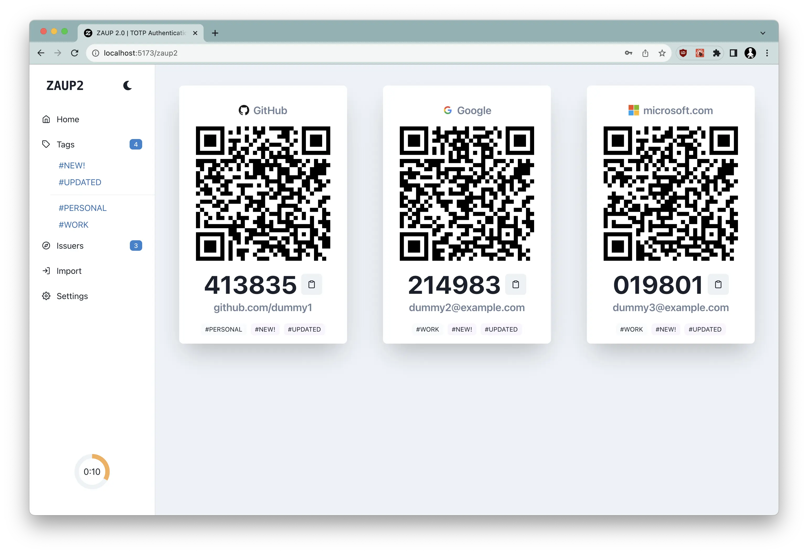
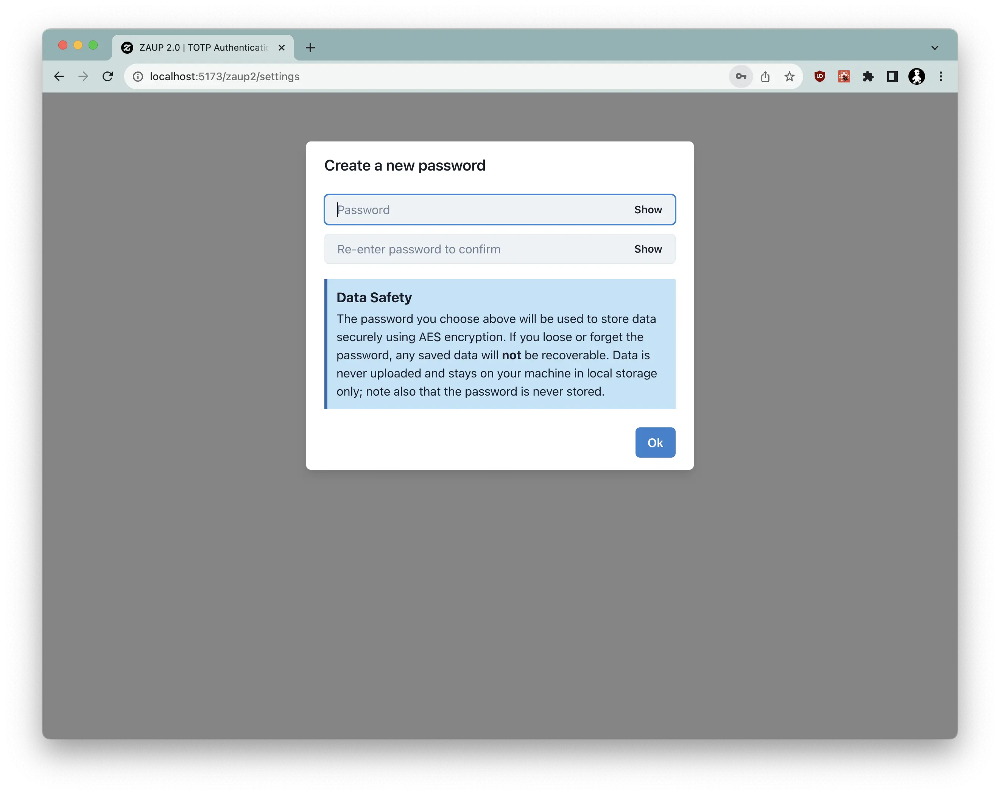
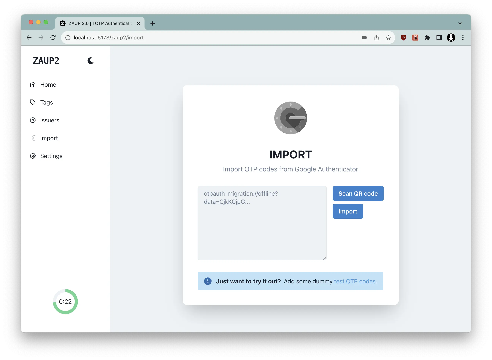
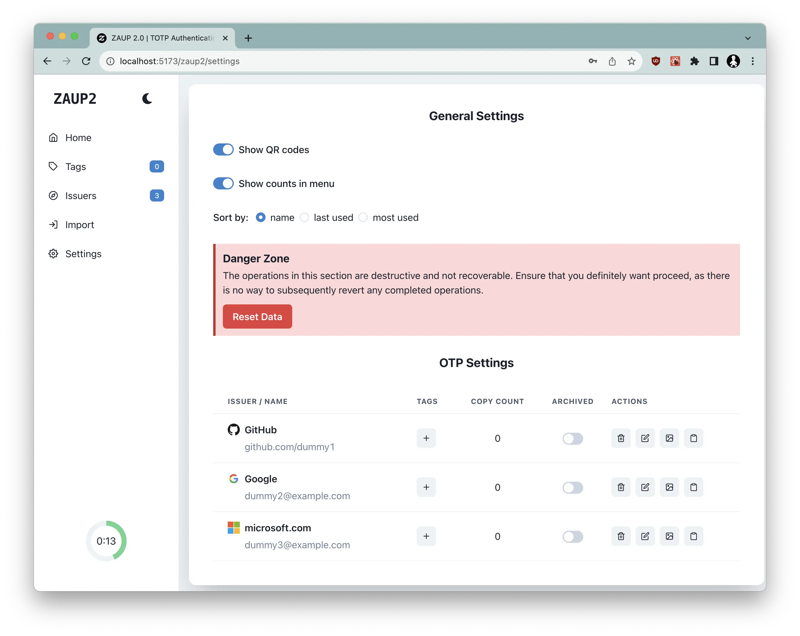
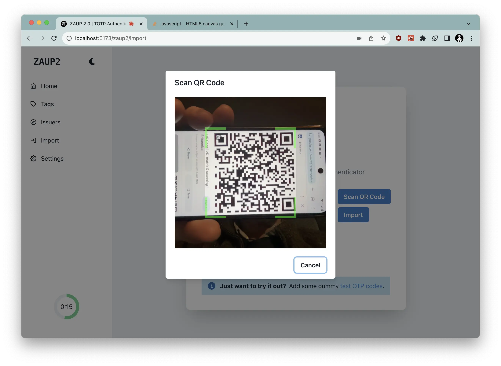

# ZAUP 2

ZAUP 2 is a [TOTP](https://en.wikipedia.org/wiki/Time-based_one-time_password) authenticator app for the web: It acts much like
[Google Authenticator](https://play.google.com/store/apps/details?id=com.google.android.apps.authenticator2&hl=en&gl=US),
but stores TOTP secrets in your browser's local storage, and they never leave your machine. Data in local storage is encrypted
using AES using a master password.



Go to https://www.destructuring-bind.org/zaup2 to see it in action. There are a set of demo OTPs that you
can import to see how it works to try it out. You will need to choose a master password first though:



Then import:



Once imported, the TOTP codes will contiunally display and update. The settings page will allow a certain level of
customisation:



## Importing from Google Authenticator

Google Authenticator has a feature that allows you to export. At the moment, this is a bit tricky, but follow these steps:

1. Export the codes from Google Authenticator on your phone
2. Take a screenshot of the resulting QR codes
3. Use Google Lens to read the resultant URI (it should start with `otpauth-migration://offline?data=`)
4. Use something like Slack or WhatsApp to make that URI available on your computer.
5. Copy the URI into the text field on the import page.

Or, if you have a webcam on your computer, pick the '**Scan QR Code**' on the import page, allow access to your camera, and
center the QR code from Google Authenticator in the preview window. Once the code is recognised, it will populate the
text field, and import.



## Running locally

You must have Node 22, Yarn and (optionally) [protobuf](https://github.com/protocolbuffers/protobuf/releases) installed.

This is optional, but if you want to regenerate the typescript files from the .proto files, first run:

```console
yarn generate
```

To begin proper:

```console
export VITE_GOOGLE_API_CLIENT_ID=<your-google-api-client-id>
yarn install
yarn dev
```

You will need to create a project in [Google Developer Console](https://console.cloud.google.com/apis/credentials) and
create an OAuth 2.0 Client ID. This can probably skipped if you dont enable **Sync to Google Drive** in the settings.

## FAQ

Why?
: It's more convenient having TOTP's available locally that can be copy-pasted rather than on my phone. It also serves as a backup if you ever loose you phone or dont have it to hand.

Isn't it less secure?
: Possibly, but the data is encrypted with AES using [Crypto-JS](https://github.com/brix/crypto-js).

## License

### MIT License

Copyright (c) 2021 Richard Hull

Permission is hereby granted, free of charge, to any person obtaining a copy
of this software and associated documentation files (the "Software"), to deal
in the Software without restriction, including without limitation the rights
to use, copy, modify, merge, publish, distribute, sublicense, and/or sell
copies of the Software, and to permit persons to whom the Software is
furnished to do so, subject to the following conditions:

The above copyright notice and this permission notice shall be included in all
copies or substantial portions of the Software.

THE SOFTWARE IS PROVIDED "AS IS", WITHOUT WARRANTY OF ANY KIND, EXPRESS OR
IMPLIED, INCLUDING BUT NOT LIMITED TO THE WARRANTIES OF MERCHANTABILITY,
FITNESS FOR A PARTICULAR PURPOSE AND NONINFRINGEMENT. IN NO EVENT SHALL THE
AUTHORS OR COPYRIGHT HOLDERS BE LIABLE FOR ANY CLAIM, DAMAGES OR OTHER
LIABILITY, WHETHER IN AN ACTION OF CONTRACT, TORT OR OTHERWISE, ARISING FROM,
OUT OF OR IN CONNECTION WITH THE SOFTWARE OR THE USE OR OTHER DEALINGS IN THE
SOFTWARE.
